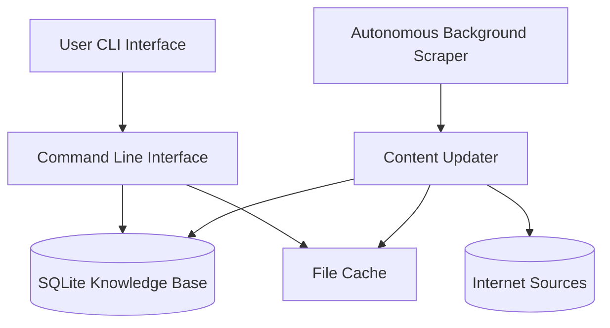

# Survival Skills AI Chatbot

[](https://github.com/yourusername/survival-ai-chatbot)
[](https://www.python.org/)
[]()
[](LICENSE)

---

## Overview

Survival Skills AI Chatbot is an **offline, autonomous survival knowledge assistant** that builds and maintains a **local, searchable database of survival information**.

The program runs as a **command-line chatbot** capable of:

- Storing survival knowledge locally
- Searching and browsing survival information
- Answering questions from stored knowledge
- Expanding its knowledge when internet access is available
- Enriching and standardizing all information to Wikipedia-level detail
- Running background updates and enrichment without blocking the CLI
- Avoiding duplicate entries and warning about disk space usage
- **Automatically searching public datasets (e.g., Project Gutenberg, Wikipedia) for relevant information**
- **Resetting the cache and database from the CLI, which triggers a full rebuild and public data scrape on next launch**

All information is stored **locally on your machine**, allowing the assistant to function even when completely offline.

---

## Features

### Local Knowledge Base

- SQLite database
- Organized survival knowledge categories
- Searchable offline
- Fast keyword queries
- Automatic enrichment for short entries
- **Automatic public dataset search and enrichment**
- **Database and cache reset from CLI**

---

### Automatic Public Dataset Search

If web scraping fails or returns no results, the system will automatically search public datasets (such as Project Gutenberg, Wikipedia) for relevant books or documents and add references to the knowledge base. This ensures the database is always enriched with high-quality, open-access information.

---

### Data Sources

- **Public datasets and documents (Project Gutenberg, Wikipedia, public domain books, open data portals)**
- Built-in survival knowledge

---

## System Architecture



---

## Local Storage Structure

The application stores its data under:

```text
~/.survival_chatbot/
```

Directory layout:

```text
.survival_chatbot/

knowledge.db

cache/
    category folders
    cached articles

media/
    videos
    pdfs
    audio
    documents

media_tracking.json
custom_sources.json
scrape_tracking.json
```

---

## Requirements

Python 3.8 or newer.

The project uses only the Python standard library:

```text
sqlite3
json
urllib
hashlib
threading
re
pathlib
datetime
time
```

No external dependencies are required.

---

## Installation

Clone the repository:

```sh
git clone https://github.com/yourusername/survival-ai-chatbot.git
cd survival-ai-chatbot
```

Run the program:

```sh
python3 offline-survival-ai.py
```

On first launch or after a cache/database reset the system will:

1. Create the local database
2. Load built-in survival knowledge
3. Scrape only public datasets (Project Gutenberg, Wikipedia)
4. Start the background scraper and enrichment

---

## CLI Interface

Main menu:

```text
+-- SURVIVAL AI CHATBOT ------------------------------------+

[1] Search knowledge
[2] Browse categories
[3] Chat
[4] View all knowledge
[5] Update knowledge
[6] Deep dive web scrape
[7] Delete the cache
[0] Exit
```

- **[7] Delete the cache**: Removes all cached files and the database. On next launch, a new database is built and a full public data scrape is triggered.

---

## Chat Example

User input:

```text
how do I start a fire without matches
```

Example response:

```text
Assistant:

Based on Fire Making Techniques
```

---

## Deep Dive Scraping

You can run a deeper scraping session from the CLI.

Menu option:

```text
6 -> Deep dive web scrape
```

This collects additional survival-related information from the web and enriches it for detail.

---

## Privacy

This project:

- Stores data locally
- Does not require accounts
- Does not use external APIs
- Does not upload user data

---

## Recent & Planned Features

### Recent Major Updates

- Autonomous dataset discovery, download, and extraction
- Disk space estimation and user warnings
- Duplicate file and knowledge entry avoidance
- Responsive CLI with background scraping and progress feedback
- Automated enrichment of short entries to Wikipedia-level detail
- Robust error handling and code optimization
- All information output standardized for detail and consistency

### Planned Improvements

- Local LLM integration
- Semantic search and vector embeddings
- Improved conversational responses
- Better scraping sources and dataset ingestion
- PDF/media indexing and downloads
- Knowledge deduplication and ranking
- Database optimization and backup tools
- Enhanced CLI navigation and user experience

---

## Long Term Vision

The long-term goal is to build a **fully autonomous offline survival knowledge system** capable of:

- Expanding its own knowledge
- Functioning without internet access
- Providing survival information in remote environments
- Acting as a resilient preparedness tool

---

## Example Interface

You can add screenshots to the repository.

Example:

```text
assets/screenshot_cli.png
```

Then reference it in the README:

```markdown

```

---

## Contributing

Contributions are welcome.

Ways to contribute:

- Improve scraping logic
- Add survival datasets
- Enhance the CLI
- Optimize the database
- Improve search capabilities

To contribute:

1. Fork the repository
2. Create a feature branch
3. Submit a pull request

---

## Disclaimer

This project is intended for **educational and preparedness purposes only**.

Always verify survival or medical information from trusted sources before relying on it in real-world situations.

---

## License

MIT License

---

If you find this project interesting, consider starring the repository.